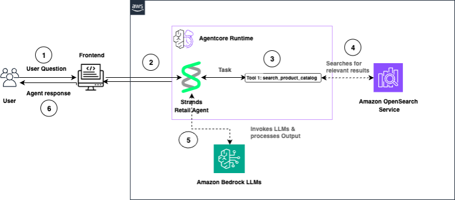

# AI Shopping Agent with Amazon Bedrock AgentCore Runtime and Amazon OpenSearch Service

This repository contains the code for building an AI-powered shopping agent using
[Strands Agents](https://github.com/strands-agents/sdk-python),
[Amazon Bedrock AgentCore Runtime](https://docs.aws.amazon.com/bedrock/latest/userguide/agentcore.html),
and [Amazon OpenSearch Service](https://aws.amazon.com/opensearch-service/).

**⚠️ IMPORTANT**: This is a sample application for demonstration and educational purposes only. It does not include authentication or HTTPS and should not be used in production without proper security configurations.

The agent performs semantic product search using natural language queries, powered by
Amazon Nova Multimodal Embeddings for vector search and Anthropic Claude for response generation.

## Architecture



### Data Flow

1. User accesses the Streamlit frontend via Application Load Balancer
2. Streamlit app (running on EC2) sends user queries to AgentCore Runtime
3. AgentCore Runtime routes requests to the Strands Retail Agent
4. Strands Agent processes the task and invokes the `search_products` tool
5. OpenSearch Service performs semantic search using Amazon Nova embeddings
6. Strands Agent uses Anthropic Claude to generate natural language responses
7. Agent response is returned through the Streamlit interface

### Infrastructure Components

- **VPC**: Private network with public and private subnets across 2 availability zones
- **Application Load Balancer**: Provides public HTTP access to the Streamlit app
- **EC2 Instance**: Runs in private subnet, hosts the agent and Streamlit app
- **NAT Gateway**: Enables outbound internet access for the EC2 instance
- **OpenSearch Service**: Vector database for semantic product search (OpenSearch 3.5)
- **Bedrock AgentCore Runtime**: Serverless agent orchestration service

### Multi-Region Support

This CloudFormation template is **fully multi-region compatible**:
- ✅ Uses AWS pseudo parameters (`AWS::Region`, `AWS::AccountId`) throughout
- ✅ AMI selection via SSM parameter (auto-resolves latest Amazon Linux 2023 per region)
- ✅ No hardcoded region-specific values
- ✅ Demo-sized instance types (t3/t2) available across regions
- ✅ Can be deployed to any AWS region that supports the required services

**Supported Regions:** Any region with Bedrock, AgentCore, OpenSearch Service, and standard VPC/EC2 services

## Prerequisites

### Required Before CloudFormation Deployment

**OpenSearch Service Domain Options:**

You have two options for the OpenSearch domain:

**Option A: Let CloudFormation create it (Recommended for new deployments)**
- Set `CreateOpenSearchDomain=true` when deploying the CloudFormation stack
- The stack will create a small OpenSearch domain (t3.small.search, 10GB) optimized for demo/development
- Domain creation takes ~15-30 minutes
- **Note:** This increases stack deployment time significantly

**Option B: Use an existing OpenSearch domain**
- Create your domain manually via AWS Console or CLI (see Step 1 below)
- Set `CreateOpenSearchDomain=false` (default) and provide your `OpenSearchDomainName`
- Use this option if you already have a domain or need custom configuration

### Other Prerequisites

2. **AWS account with appropriate permissions for:**
   - CloudFormation
   - EC2, VPC, and Application Load Balancer
   - IAM role creation
   - Amazon Bedrock (Claude and Nova models)
   - Amazon Bedrock AgentCore Runtime
   - Amazon OpenSearch Service
   - Systems Manager (SSM)
  - OpenSearch Service 2.13 or later (3.5 recommended)

3. **AWS CLI configured with credentials**

4. **Model Access in Amazon Bedrock:**
   - Anthropic Claude Haiku 4.5
   - Amazon Nova Multimodal Embeddings

## Repository Structure

| File | Description |
|------|-------------|
| `cloudformation.yaml` | CloudFormation template — VPC, NAT gateway, EC2 instance, and all IAM roles/policies |
| `requirements.txt` | Python dependencies |
| `create_connector.py` | Creates ML connector between OpenSearch and Bedrock Nova embeddings |
| `opensearch_setup.md` | OpenSearch Dashboards Dev Tools commands |
| `search_agent.py` | Strands Agent with product search tool |
| `agentcore.py` | Deploys the agent to Bedrock AgentCore Runtime |
| `app.py` | Streamlit frontend for the shopping agent |

## Setup Steps

### 1. Deploy the CloudFormation Stack

**Option A: Create OpenSearch domain automatically (Recommended for demo)**

```bash
aws cloudformation deploy \
  --template-file cloudformation.yaml \
  --stack-name shopping-agent \
  --parameter-overrides \
      CreateOpenSearchDomain=true \
      OpenSearchDomainName=shopping-agent-search \
      OpenSearchMasterUsername=admin \
      OpenSearchMasterPassword='YourSecurePassword123!' \
  --capabilities CAPABILITY_NAMED_IAM \
  --region <your-region>
```

Replace `<your-region>` with your desired AWS region (e.g., `us-east-1`, `us-west-2`, `eu-west-1`).

**Note:** The master username and password will be displayed in CloudFormation outputs for easy access to OpenSearch Dashboards during the demo.

**Option B: Use existing OpenSearch domain**

If you already have an OpenSearch domain:

```bash
aws cloudformation deploy \
  --template-file cloudformation.yaml \
  --stack-name shopping-agent \
  --parameter-overrides \
      CreateOpenSearchDomain=false \
      OpenSearchDomainName=os-test-domain \
  --capabilities CAPABILITY_NAMED_IAM \
  --region <your-region>
```

**Or create a domain manually first:**

```bash
aws opensearch create-domain \
  --domain-name os-test-domain \
  --engine-version OpenSearch_3.5 \
  --cluster-config InstanceType=t3.small.search,InstanceCount=1 \
  --ebs-options EBSEnabled=true,VolumeType=gp3,VolumeSize=10 \
  --access-policies '{"Version":"2012-10-17","Statement":[{"Effect":"Allow","Principal":{"AWS":"*"},"Action":"es:*","Resource":"*"}]}' \
  --region <your-region>
```

### 2. CloudFormation Stack Components

The CloudFormation template creates:

- **OpenSearch Service domain** (optional - if `CreateOpenSearchDomain=true`)
- **VPC** with 2 public subnets (for ALB) and 1 private subnet (for EC2)
- **Application Load Balancer** in public subnets for secure internet access
- **NAT Gateway** for outbound internet connectivity from private subnet
- **EC2 instance** in private subnet with Python 3.11, git, and all dependencies
- **Security Groups** configured for ALB → EC2 communication on port 8501
- **EC2 instance role** with permissions for Bedrock, AgentCore, ECR, OpenSearch
- **OpenSearchBedrockEmbeddingRole** for OpenSearch to invoke Bedrock embeddings

**⏱️ Deployment Time:**
- Without OpenSearch: ~5-10 minutes
- With OpenSearch: ~20-35 minutes (domain creation is slow)

> **Alternative:** If you prefer not to use CloudFormation, install Python 3.11 locally,
> run `pip install -r requirements.txt`, and create the IAM roles manually as described in the blog post.

### 2. Connect to the EC2 Instance and Map OpenSearch Permissions

After the stack completes, you need to map two roles in OpenSearch Dashboards before proceeding with ML connector creation:

#### Map Roles in OpenSearch Dashboards

1. **Map EC2 Instance Role to ml_full_access** (required for ML connector creation):
   - Open OpenSearch Dashboards → Security → Roles → **ml_full_access**
   - Click **Mapped Users** → **Manage Mapping**
   - Under **Backend roles**, add the EC2 role ARN from the stack outputs:
     `arn:aws:iam::<ACCOUNT_ID>:role/shopping-agent-EC2Role`

2. **Map BedrockEmbeddingRole to ml_full_access** (required for OpenSearch to invoke Bedrock):
   - In the same **ml_full_access** role mapping
   - Under **Backend roles**, also add the BedrockEmbeddingRole ARN from stack outputs:
     `arn:aws:iam::<ACCOUNT_ID>:role/OpenSearchBedrockEmbeddingRole-<REGION>`

#### Connect to EC2 Instance

Connect to the instance via SSM Session Manager. The instance ID is in the stack outputs.

```bash
aws ssm start-session --target <instance-id> --region <your-region>
```

Switch to root using sudo:

```bash
sudo su
# or
sudo bash
```

Python 3.11 and all pip dependencies are already installed. Create a working directory and clone this repo:

```bash
mkdir -p ~/shopping-agent
cd ~/shopping-agent
git clone <your-repo-url> .
```

### 3. Create ML Connector

Edit `create_connector.py` and set `host`, `region`, and `account_id`, then run:

```bash
python3.11 create_connector.py
```

Note the `connector_id` from the output.

### 4. Register and Deploy Model (OpenSearch Dashboards)

Follow the commands in `opensearch_setup.md` using OpenSearch Dashboards Dev Tools:
- Create a model group
- Register the model with your connector_id
- Deploy the model

### 5. Create Pipeline, Index, and Ingest Data (OpenSearch Dashboards)

Continue with the remaining commands in `opensearch_setup.md`:
- Create the ingest pipeline
- Create the product index
- Ingest sample data
- Test with a query

### 6. Configure OpenSearch Security for Agent

In OpenSearch Dashboards Security:
1. Create a role named `agent-permissions`
2. Add cluster permissions: `cluster:admin/opensearch/ml/models/get`, `cluster:admin/opensearch/ml/predict`
3. Add index permissions for `product*`: `search`, `get`
4. Map the EC2 instance role as a backend role

### 7. Test the Agent Locally

Edit `search_agent.py` and set `host`, `region`, and `model_id` in the `search_products` function.

For local testing, uncomment the test line and comment `app.run()`:

```python
strands_agent_bedrock({"prompt": "Search jacket"})  # Uncomment for testing
# app.run()  # Comment for testing
```

```bash
python3.11 search_agent.py
```

### 8. Deploy to AgentCore Runtime

Revert `search_agent.py` for deployment (comment test line, uncomment `app.run()`).

Edit `agentcore.py` and set `REGION` and `OPENSEARCH_DOMAIN_NAME`, then run:

```bash
python3.11 agentcore.py
```

**Save the Agent Runtime ARN** from the output — you'll need it for the Streamlit app configuration.

### 9. Map AgentCore Execution Role in OpenSearch

In OpenSearch Dashboards, add the AgentCore execution role as a backend role for `agent-permissions`:

```
arn:aws:iam::<ACCOUNT_ID>:role/AmazonBedrockAgentCoreSDKRuntime-<REGION>-custom
```

### 10. Run the Streamlit Frontend

After deploying the agent, configure and run the Streamlit app on the EC2 instance.

#### Configure the App

Clone this repository and edit `app.py` with your configuration:

```bash
cd ~/shopping-agent
git clone <your-repo-url> .
```

Edit `app.py` and set:
```python
REGION = "us-east-1"  # Your AWS region
AGENT_RUNTIME_ARN = "arn:aws:bedrock-agentcore:..."  # From Step 8 output
```

#### Start the Streamlit App

Run the app, binding to all interfaces so the ALB can reach it:

```bash
streamlit run app.py --server.port 8501 --server.address 0.0.0.0
```

**Tip**: To run in the background, use:
```bash
nohup streamlit run app.py --server.port 8501 --server.address 0.0.0.0 > streamlit.log 2>&1 &
```

#### Access the Application

Get the Load Balancer URL from CloudFormation stack outputs:

```bash
aws cloudformation describe-stacks \
  --stack-name shopping-agent \
  --query 'Stacks[0].Outputs[?OutputKey==`StreamlitAppURL`].OutputValue' \
  --output text
```

Open the URL in your browser: `http://<alb-dns-name>`

The Application Load Balancer routes public HTTP traffic to the private EC2 instance running Streamlit.

**⚠️ SECURITY WARNING**: This is a sample application for demonstration and learning purposes only:
- **No authentication** - The application is publicly accessible to anyone with the URL
- **HTTP only** - Traffic is not encrypted (no HTTPS)
- **Not for production use** - This is a demo configuration for blog post/tutorial purposes

## Cleanup

To avoid incurring future charges, delete resources in this order:

1. **Stop the Streamlit app** (if running) on the EC2 instance
2. **Delete the AgentCore Runtime**:
   ```bash
   # Use the bedrock-agentcore CLI or AWS console
   ```
3. **Delete the CloudFormation stack**:
   ```bash
   aws cloudformation delete-stack --stack-name shopping-agent
   ```

The CloudFormation stack deletion will automatically remove:
- **OpenSearch Service domain** (if created by the stack) - takes 15-30 minutes
- Application Load Balancer and Target Group
- EC2 instance and associated resources
- VPC, subnets, NAT Gateway, and Internet Gateway
- Security Groups
- IAM roles and policies (EC2 role and OpenSearch embedding role)

**Note**: 
- If you created the OpenSearch domain manually (outside CloudFormation), you must delete it separately
- NAT Gateway and OpenSearch domain incur the highest costs. Delete promptly when done testing.
- Stack deletion may take 20-40 minutes if OpenSearch domain was created by CloudFormation

## Authors

- Omama Khurshid — GTM Specialist Solutions Architect Analytics, AWS
- Jumana Nagaria — Prototyping Architect, AWS
- Canberk Keles — Solutions Architect, AWS
