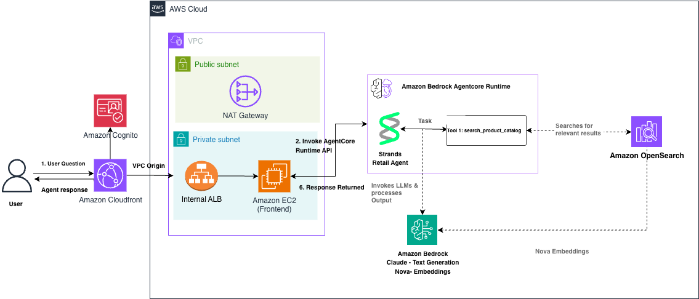
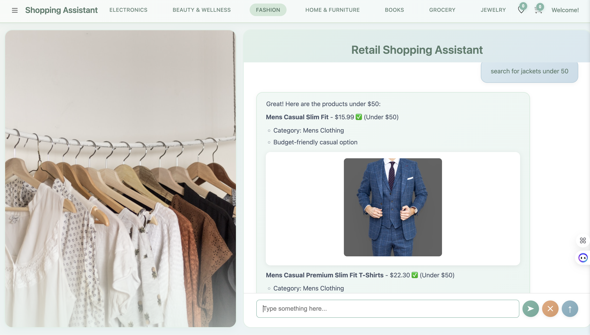

# AI Shopping Agent with Amazon Bedrock AgentCore Runtime and Amazon OpenSearch Service

This repository contains the code for building an AI-powered shopping agent using
[Strands Agents](https://github.com/strands-agents/sdk-python),
[Amazon Bedrock AgentCore Runtime](https://docs.aws.amazon.com/bedrock/latest/userguide/agentcore.html),
and [Amazon OpenSearch Service](https://aws.amazon.com/opensearch-service/).

**⚠️ IMPORTANT**: This is a sample application for demonstration and educational purposes only. It should not be used in production without additional security hardening.

The agent performs semantic product search using natural language queries, powered by
Amazon Nova Multimodal Embeddings for vector search and Anthropic Claude for response generation.

## Architecture



### Data Flow

1. User accesses the shopping assistant frontend via CloudFront (HTTPS)
2. CloudFront routes request via VPC Origin to internal ALB, then to EC2
3. Frontend app (running on EC2) sends user queries to AgentCore Runtime
3. AgentCore Runtime routes requests to the Strands Retail Agent
4. Strands Agent processes the task and invokes the `search_products` tool
5. OpenSearch Service performs semantic search using Amazon Nova embeddings
6. Strands Agent uses Anthropic Claude to generate natural language responses
7. Agent response is returned through the frontend interface

### Infrastructure Components

- **VPC**: Private network with public and private subnets across 2 availability zones
- **CloudFront Distribution**: Provides HTTPS access with TLS 1.2+ via VPC Origin
- **Amazon Cognito**: User authentication with hosted UI login (self-signup disabled)
- **Internal Application Load Balancer**: Routes traffic from CloudFront to EC2 (private, no public access)
- **EC2 Instance**: Runs in private subnet, hosts the frontend app and deploys agent via AgentCore CLI
- **NAT Gateway**: Enables outbound internet access for the EC2 instance
- **OpenSearch Service**: Vector database for semantic product search (OpenSearch 3.5)
- **Bedrock AgentCore Runtime**: Serverless agent orchestration service

### Multi-Region Support

This CloudFormation template is **fully multi-region compatible**:
- ✅ Uses AWS pseudo parameters (`AWS::Region`, `AWS::AccountId`) throughout
- ✅ AMI selection via SSM parameter (auto-resolves latest Amazon Linux 2023 per region)
- ✅ No hardcoded region-specific values
- ✅ Demo-sized OpenSearch instance types (t3.medium) available across regions
- ✅ Can be deployed to any AWS region that supports the required services

**Supported Regions:** Any region with Bedrock, AgentCore, OpenSearch Service, and standard VPC/EC2 services

## Prerequisites

### Required Before CloudFormation Deployment

**OpenSearch Service Domain Options:**

You have two options for the OpenSearch domain:

**Option A: Let CloudFormation create it (Recommended for new deployments)**
- Set `CreateOpenSearchDomain=true` when deploying the CloudFormation stack
- The stack will create an OpenSearch domain (2x t3.medium.search nodes, 20GB each) optimized for demo/development
- Domain creation takes ~15-30 minutes
- **Note:** This increases stack deployment time significantly

**Option B: Use an existing OpenSearch domain**
- Create your domain manually via AWS Console or CLI (see Step 1 below)
- Set `CreateOpenSearchDomain=false` (default) and provide your `OpenSearchDomainName`
- Use this option if you already have a domain or need custom configuration

### Other Prerequisites

2. **AWS account with appropriate permissions for:**
   - CloudFormation
   - EC2, VPC, and Application Load Balancer
   - IAM role creation
   - Amazon Bedrock (Claude and Nova models)
   - Amazon Bedrock AgentCore Runtime
   - Amazon OpenSearch Service
   - Systems Manager (SSM)
  - OpenSearch Service 2.13 or later (3.5 recommended)

3. **AWS CLI configured with credentials**

4. **Model Access in Amazon Bedrock:**
   - Anthropic Claude Haiku 4.5
   - Amazon Nova Multimodal Embeddings

## Repository Structure

| File | Description |
|------|-------------|
| `cloudformation.yaml` | CloudFormation template — VPC, NAT gateway, EC2 instance, and all IAM roles/policies |
| `requirements.txt` | Python dependencies for the agent |
| `create_connector.py` | Creates ML connector between OpenSearch and Bedrock Nova embeddings |
| `opensearch_setup.md` | OpenSearch Dashboards Dev Tools commands |
| `search_agent.py` | Strands Agent with product search tool |
| `agentcore.py` | Deploys the agent to Bedrock AgentCore Runtime |
| `frontend/api.py` | Flask API backend — bridges frontend to AgentCore Runtime |
| `frontend/index.html` | Shopping assistant HTML interface |
| `frontend/script.js` | Frontend JavaScript (chat, cart, product display) |
| `frontend/styles.css` | Frontend styling |
| `frontend/requirements.txt` | Python dependencies for the frontend (Flask) |

## Setup Steps

### 1. Deploy the CloudFormation Stack

**Option A: Create OpenSearch domain automatically (Recommended for demo)**

```bash
aws cloudformation deploy \
  --template-file cloudformation.yaml \
  --stack-name shopping-agent \
  --parameter-overrides \
      CreateOpenSearchDomain=true \
      OpenSearchDomainName=shopping-agent-search \
      OpenSearchAdminUsername=admin \
      OpenSearchAdminPassword='YourSecurePassword123!' \
  --capabilities CAPABILITY_NAMED_IAM \
  --region <your-region>
```

Replace `<your-region>` with your desired AWS region (e.g., `us-east-1`, `us-west-2`, `eu-west-1`).

**Note:** The master username and password will be displayed in CloudFormation outputs for easy access to OpenSearch Dashboards during the demo.

**Option B: Use existing OpenSearch domain**

If you already have an OpenSearch domain:

```bash
aws cloudformation deploy \
  --template-file cloudformation.yaml \
  --stack-name shopping-agent \
  --parameter-overrides \
      CreateOpenSearchDomain=false \
      OpenSearchDomainName=<your-existing-domain-name> \
  --capabilities CAPABILITY_NAMED_IAM \
  --region <your-region>
```

**Or create a domain manually first:**

```bash
aws opensearch create-domain \
  --domain-name os-test-domain \
  --engine-version OpenSearch_3.5 \
  --cluster-config InstanceType=t3.medium.search,InstanceCount=2 \
  --ebs-options EBSEnabled=true,VolumeType=gp3,VolumeSize=20 \
  --access-policies '{"Version":"2012-10-17","Statement":[{"Effect":"Allow","Principal":{"AWS":"*"},"Action":"es:*","Resource":"*"}]}' \
  --region <your-region>
```

### 2. CloudFormation Stack Components

The CloudFormation template creates:

- **OpenSearch Service domain** (optional - if `CreateOpenSearchDomain=true`)
- **VPC** with 2 public subnets (for ALB) and 2 private subnets (for EC2)
- **CloudFront Distribution** with VPC Origin for HTTPS access
- **Amazon Cognito User Pool** with hosted UI login (self-signup disabled)
- **Internal Application Load Balancer** in private subnets
- **NAT Gateway** for outbound internet connectivity from private subnet
- **EC2 instance** in private subnet with Python 3.11, Node.js 20, AgentCore CLI, git, and all dependencies
- **Security Groups** configured for CloudFront VPC Origin → ALB → EC2 on port 8501
- **EC2 instance role** with permissions for Bedrock, AgentCore, ECR, OpenSearch
- **OpenSearchBedrockEmbeddingRole** for OpenSearch to invoke Bedrock embeddings

**⏱️ Deployment Time:**
- Without OpenSearch: ~5-10 minutes
- With OpenSearch: ~20-35 minutes (domain creation is slow)

> **Alternative:** If you prefer not to use CloudFormation, install Python 3.11 locally,
> run `pip install -r requirements.txt`, and create the IAM roles manually as described in the blog post.

### 2. Connect to the EC2 Instance

#### Connect to EC2 Instance

Connect to the instance via SSM Session Manager. The instance ID is in the stack outputs.

```bash
aws ssm start-session --target <instance-id> --region <your-region>
```

Switch to root using sudo:

```bash
sudo su
# or
sudo bash
```

Python 3.11 and all pip dependencies are already installed. Create a working directory and clone this repo:

```bash
mkdir -p ~/shopping-agent
cd ~/shopping-agent
git clone <your-repo-url> .
```

### 3. Create ML Connector and Map BedrockEmbeddingRole

First, map the BedrockEmbeddingRole and EC2 Instance Role in OpenSearch Dashboards (required for OpenSearch to invoke Bedrock):

1. Open OpenSearch Dashboards → Security → Roles → **ml_full_access**
2. Click **Mapped Users** → **Manage Mapping**
3. Under **Backend roles**, add the BedrockEmbeddingRole ARN from stack outputs:
   `arn:aws:iam::<ACCOUNT_ID>:role/OpenSearchBedrockEmbeddingRole-<REGION>` and EC2RoleARN from stack outputs:
   `arn:aws:iam::<ACCOUNT_ID>:role/shopping-agent-EC2Role`

Then, edit `create_connector.py` and set `host`, `region`, and `account_id`, then run:

```bash
python3.11 create_connector.py
```

Note the `connector_id` from the output.

### 3b. Configure OpenSearch Security for Setup Operations

Before registering models and creating ingest pipelines, the `admin` master user needs additional permissions. OpenSearch fine-grained access control does not grant ML or ingest pipeline permissions by default.

#### Create a Custom Role

1. In OpenSearch Dashboards, go to **Security** → **Roles** → **Create role**
2. **Name:** `shopping_agent_setup`
3. **Cluster permissions** — add these individually:
   ```
   cluster:admin/ingest/pipeline/put
   cluster:admin/ingest/pipeline/get
   cluster:admin/ingest/pipeline/delete
   cluster:admin/opensearch/ml/create_connector
   cluster:admin/opensearch/ml/register_model_group
   cluster:admin/opensearch/ml/register_model
   cluster:admin/opensearch/ml/deploy_model
   cluster:admin/opensearch/ml/predict
   cluster:admin/opensearch/ml/undeploy_model
   cluster:admin/opensearch/ml/delete_model
   cluster:admin/opensearch/ml/delete_connector
   cluster:admin/opensearch/ml/models/get
   cluster:monitor/nodes/info
   cluster:monitor/health
   ```
4. **Index permissions:**
   - Index patterns: `*`
   - Allowed actions — add these individually:
   ```
   indices:admin/create
   indices:admin/delete
   indices:admin/mapping/put
   indices:data/write/index
   indices:data/write/bulk
   indices:data/write/delete
   indices:data/read/search
   indices:data/read/get
   ```
5. Click **Create**

#### Map the Admin User to the Role

1. Go to **Security** → **Roles** → **`shopping_agent_setup`** → **Mapped users**
2. Click **Manage mapping**
3. Under **Users**, add: `admin`
4. Click **Map**

> **Note:** Wildcard permissions (e.g., `cluster:admin/opensearch/ml/*`) are not supported in all OpenSearch versions. Use explicit permissions as listed above.

### 4. Register and Deploy Model (OpenSearch Dashboards)

Follow the commands in `opensearch_setup.md` using OpenSearch Dashboards Dev Tools:
- Create a model group
- Register the model with your connector_id
- Deploy the model

### 5. Create Pipeline, Index, and Ingest Data (OpenSearch Dashboards)

Continue with the remaining commands in `opensearch_setup.md`:
- Create the ingest pipeline
- Create the product index
- Ingest sample data
- Test with a query

### 6. Configure OpenSearch Security for Agent and Test Locally

#### Create the `agent-permissions` Role

In OpenSearch Dashboards, create a role that allows the agent to search products and invoke the ML model:

1. Go to **Security** → **Roles** → **Create role**
2. **Role name:** `agent-permissions`
3. **Cluster permissions** — add:
   - `cluster:admin/opensearch/ml/models/get`
   - `cluster:admin/opensearch/ml/predict`
4. **Index permissions:**
   - Index patterns: `product*`
   - Allowed actions: `indices:data/read/search`, `indices:data/read/get`
5. Click **Create**

#### Map IAM Principals to the Role

1. Click on the newly created `agent-permissions` role
2. Go to the **Mapped users** tab → **Manage mapping**
3. Under **Backend roles**, add:
   - EC2 instance role ARN: `arn:aws:iam::<ACCOUNT_ID>:role/shopping-agent-EC2Role`
4. Under **Users**, add any IAM users that will run the agent locally for testing:
   - `arn:aws:iam::<ACCOUNT_ID>:user/<YourIAMUser>`
5. Click **Map**

#### Test the Agent Locally

Edit `search_agent.py` and set `host`, `region`, and `model_id` in the `search_products` function.

> **Important:** The `model_id` inside `search_products` must be your **OpenSearch embedding model ID** (from Step 4), NOT the Claude/Bedrock LLM model ID used for the agent.

For local testing, uncomment the test line and comment `app.run()`:

```python
strands_agent_bedrock({"prompt": "Search jacket"})  # Uncomment for testing
# app.run()  # Comment for testing
```

```bash
python3.11 search_agent.py
```

### 8. Deploy to AgentCore Runtime

1. Create the AgentCore project and replace with your search agent:

   ```bash
   cd ~/shopping-agent
   agentcore create --name ShoppingAgent --defaults
   cd ShoppingAgent
   cp ../search_agent.py app/ShoppingAgent/main.py
   ```

2. Add OpenSearch and other dependencies:

   ```bash
   cd app/ShoppingAgent
   uv add opensearch-py requests-aws4auth boto3
   cd ../..
   ```

3. Deploy (takes approximately 5-10 minutes):

   ```bash
   agentcore deploy
   ```

4. Verify deployment and note the Runtime ARN:

   ```bash
   agentcore status
   ```

   You should see:
   ```
   ShoppingAgent: Deployed - Runtime: READY (arn:aws:bedrock-agentcore:<REGION>:<ACCOUNT_ID>:runtime/ShoppingAgent_...)
   URL: https://bedrock-agentcore.<REGION>.amazonaws.com/runtimes/.../invocations
   ```

   **Save the Runtime ARN** — you'll need it for the frontend configuration.

### 9. Map AgentCore Execution Role in OpenSearch

The AgentCore CLI creates an execution role automatically. Map it in OpenSearch so the deployed agent can query your product index.

1. Find the execution role: **IAM Console** → **Roles** → search for `BedrockAgentCore`
2. Copy the execution role ARN
3. Go to **Security** → **Roles** → **`agent-permissions`** → **Mapped users** → **Manage mapping**
4. Under **Backend roles**, add the execution role ARN from step 1
5. Click **Map**

### 10. Run the Frontend

After deploying the agent, configure and run the shopping assistant frontend on the EC2 instance.

#### Install Frontend Dependencies

```bash
cd ~/shopping-agent/frontend
pip3.11 install -r requirements.txt
```

#### Configure the App

Edit `frontend/api.py` using `nano` (or `vi`):

```bash
nano api.py
```

Set the following values (then save with `Ctrl+O`, exit with `Ctrl+X`):

```python
REGION = "us-east-1"  # Your AWS region
AGENT_RUNTIME_ARN = "arn:aws:bedrock-agentcore:us-east-1:<ACCOUNT_ID>:runtime/<AGENT_NAME>"  # From agentcore status output
```

> **⚠️ Important:** The `AGENT_RUNTIME_ARN` must be the **runtime ARN only** — do NOT include `/runtime-endpoint` or `/runtime-endpoint/DEFAULT` at the end. The correct format is:
> ```
> arn:aws:bedrock-agentcore:<REGION>:<ACCOUNT_ID>:runtime/<AGENT_ID>
> ```

#### Start the Frontend

Run the app on port 8501 (to match the ALB target group), binding to all interfaces:

```bash
python3.11 api.py
```

**Tip**: To run in the background, use:
```bash
nohup python3.11 api.py > api.log 2>&1 &
```

#### Access the Application

Get the CloudFront URL from CloudFormation stack outputs:

```bash
aws cloudformation describe-stacks \
  --stack-name shopping-agent \
  --query 'Stacks[0].Outputs[?OutputKey==`AppURL`].OutputValue' \
  --output text
```

Open the URL in your browser: `https://<cloudfront-domain>`

You will be redirected to the **Cognito login page**. Use the credentials created by your administrator.

> **Note:** Users are created via the Cognito console or CLI — self-signup is disabled. To create a user:
> ```bash
> aws cognito-idp admin-create-user \
>   --user-pool-id <POOL_ID> \
>   --username user@example.com \
>   --temporary-password "TempPass1!" \
>   --user-attributes Name=email,Value=user@example.com Name=email_verified,Value=true
>
> aws cognito-idp admin-set-user-password \
>   --user-pool-id <POOL_ID> \
>   --username user@example.com \
>   --password "YourPassword1!" \
>   --permanent
> ```

#### Try These Sample Queries

Once logged in, try asking:
- "Search for jackets under $50"
- "Find men's clothing"
- "Show me jewelry"
- "What t-shirts are available?"
- "Search for a backpack"



## Cleanup

To avoid incurring future charges, delete resources in this order:

1. **Stop the frontend app** (if running) on the EC2 instance
2. **Delete the AgentCore Runtime**:
   ```bash
   cd ShoppingAgent
   agentcore remove all
   agentcore deploy
   ```
3. **Delete the CloudFormation stack**:
   ```bash
   aws cloudformation delete-stack --stack-name shopping-agent
   ```

The CloudFormation stack deletion will automatically remove:
- **OpenSearch Service domain** (if created by the stack) - takes 15-30 minutes
- Application Load Balancer and Target Group
- EC2 instance and associated resources
- VPC, subnets, NAT Gateway, and Internet Gateway
- Security Groups
- IAM roles and policies (EC2 role and OpenSearch embedding role)

**Note**: 
- If you created the OpenSearch domain manually (outside CloudFormation), you must delete it separately
- NAT Gateway and OpenSearch domain incur the highest costs. Delete promptly when done testing.
- Stack deletion may take 20-40 minutes if OpenSearch domain was created by CloudFormation

## License

This library is licensed under the MIT-0 License. See the [LICENSE](LICENSE) file.

## Authors

- Omama Khurshid — GTM Specialist Solutions Architect Analytics, AWS
- Jumana Nagaria — Prototyping Architect, AWS
- Canberk Keles — Solutions Architect, AWS
